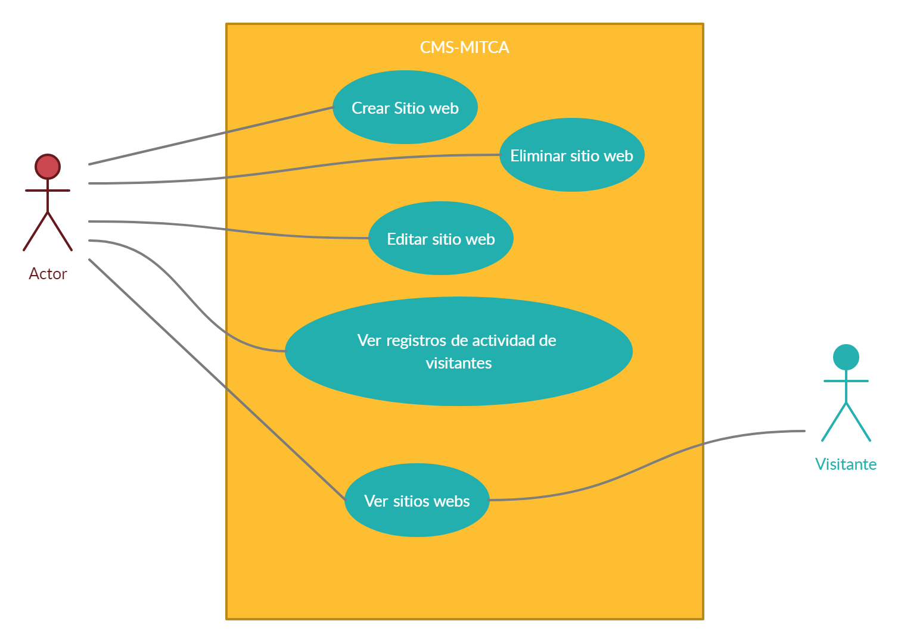

# Proyecto Mitca : Documentación

## Índice
* [1. Introducción](#idIntroduccion)

* [2. Modelo de Datos	](#idModelo)

* [3. Requisitos de Usuario](#idReqUsu)

* [4. Casos de Uso](#idCasosDeUso)

* [5. Descripción del funcionamiento del sistema y especificaciones técnicas de la aplicación del servidor, móvil y web](#idDescripcion)

* [6. Interfaces](#idInterfaces)
  * [6.1. Diseño Inicial](#idDiseño)
  * [6.2. Usabilidad](#idUsabilidad)

* [7. Manuales](#idManuales)

* [8. Pila Tecnológica](#idPilaTecnologica)

* [9. Comparación de tecnologías](#idComparacionTecnologias)

* [10. Repositorios](#idRepositorios)

* [11. Planificación](#idPlanificacion)

* [12. Conclusiones](#idConclusiones)

* [13. Enlaces  y referencias](#idEnlaceReferencias)

## 1. Introducción

La idea surge de la necesidad de que en las áreas de maquetación y gestión necesitan una herramienta para poder realizar páginas web rápidas.
Por ello se me ha propuesto realizar un CMS(Content Management System)
Se trata de desarrollar un CMS (Content Management System) que permitirá crear sitios webs. Lo más parecido al plugin Elementor de Wordpress, el cual permite realizar paginas web en tiempo real. 

## 2. Diagramas
Aqui se mostrara como esta organizada la base de datos del proyecto.
### Modelo Relacional

### Diagrama E/R

## 3. Requisitos de usuario

En esta aplicación hay dos tipos de usuarios, los 2 tendrán que identificarse para poder acceder a la información sobre los sitios web.  Los roles que tendrá la aplicación son: Visitante y Editor.

Editor: El editor podrá crear,editar y eliminar sitios webs, páginas y contenido.
 
Visitante: El visitante solo puede ver el contenido de los sitios webs, las paginas de los sitios webs y el contenido de esas páginas webs.

 Una funcionalidad para tener en cuenta es que el editor puede ver toda la actividad de un visitante.
## 4. Casos de Uso

## 5. Descripción del funcionamiento del sistema y especificaciones técnicas de la aplicación

## 6. Interfaces

### 6.1. Diseño Inicial:

### 6.2. Usabilidad:

## 7. Manuales

## 8. Pila Tecnológica
Esta aplicación utiliza lo que se conoce como MERN.
### ¿Que es MERN?
MERN es un stack en el que se usa JavaScript tanto en el cliente como en el servidor es decir Full Stack JavaScript. Toda la aplicación estará hecha en JavaScript.
### Mongo
Esta es una de las bases de datos no relacionales más famosas que hay. Integrar Mongo y JavaScript es super sencillo con la ayuda de mongoose, una librería que nos permite modelar la información de la base de datos.
### Express
Express te permite crear una infraestructura sólida para tu web, con el puedes manejar todo el Backend con Node, rutas (en caso de que no uses react-router), orquestar todo el manejo de Webpack, errores o cualquier cosa que necesites.
### React
React como muchos saben es una librería creada y mantenida por Facebook, esta te permite desarrollar el Frontend de tu aplicación de una manera limpia, organizada y permitirá que la interacción entre usuarios y la aplicación sea mucho más efectiva.
### Node.js
Node.js es un entorno JavaScript de lado de servidor que utiliza un modelo asíncrono y dirigido por eventos.
## 9. Comparación de tecnologías
### MEAN

Es una pila de tecnología muy popular y es una pila completa. "MEAN" es una abreviatura y las letras representan MongoDB, Express.js, Angular y Node.js, respectivamente. Los programadores usan esta pila para desarrollar aplicaciones web. También lo usan para desarrollar aplicaciones móviles, sin embargo, estamos hablando de aplicaciones móviles híbridas.

### MERN

La abreviatura MERN significa MongoDB-Express.js-React-Node.js, y puede crear aplicaciones móviles híbridas y web con él. Al igual que MEAN, MERN también es una colección de bases de datos, marcos y entornos de ejecución basados en JavaScript. La pila MERN ofrece un marco de trabajo de un extremo a otro para los desarrolladores y su popularidad está creciendo rápidamente.

### Diferencias entre MEAN y MERN

La popularidad de Angular vs React impulsa la popularidad de las pilas MEAN vs MERN, respectivamente. Angular ha sido un marco muy popular desde hace bastante tiempo, sin embargo, React lo está superando en los últimos años. La falta de compatibilidad con versiones anteriores entre Angular 2 y Angular 1 parece haber afectado negativamente la popularidad de Angular. La curva de aprendizaje entre las distintas pilas es distinta, Angular trabaja un marco completo y usa Typescript y plantillas. Mientras que react es un conjunto de librerías las que puedes elegir y tener mas libertad.

## 10. Repositorios

## 11. Planificación

## 12. Conclusiones

## 13. Enlaces y referencias
